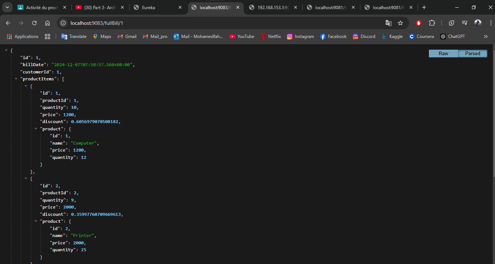

<h2>Backend Architecture - Spring Boot Microservices</h2>

Ce document présente l'architecture du backend de notre application basée sur Spring Boot, qui utilise des microservices pour gérer les différentes fonctionnalités. L'architecture comprend plusieurs services, chacun ayant un rôle spécifique dans le système global.

## 1. Architecture du Backend

L'architecture de l'application backend est composée des services suivants :

### 1.1. customer-service
Le service customer-service gère toutes les opérations liées aux clients. Il permet de créer, lire, mettre à jour et supprimer les informations des clients. Ce service expose des endpoints RESTful qui sont utilisés par d'autres services pour interagir avec les données des clients.

### 1.2. inventory-service
Le service inventory-service est responsable de la gestion de l'inventaire des produits. Il suit les quantités de stock disponibles, met à jour les informations sur les produits, et traite les demandes des utilisateurs concernant les articles en stock.

### 1.3. gateway-service
Le service gateway-service agit comme un point d'entrée pour toutes les demandes externes. Il fonctionne comme un API Gateway qui redirige les requêtes HTTP vers les services appropriés en interne, en offrant également des fonctionnalités telles que la gestion des autorisations et des rôles, ainsi que le routage des requêtes.

### 1.4. discovery-service
Le service discovery-service est basé sur *Eureka*, une solution de découverte de services. Il permet à chaque microservice de se déclarer automatiquement et de s'enregistrer dans le registre de services Eureka. Il facilite la communication entre les services sans que les URL de chaque service soient codées en dur.

### 1.5. billing-service
Le service billing-service gère les factures des clients. Il permet de générer des factures pour les clients en fonction de leurs achats et de suivre les paiements associés. Ce service expose des endpoints pour récupérer les factures et effectuer des paiements.

### 1.6. config-service
Le service config-service est utilisé pour centraliser et gérer la configuration de tous les microservices. Il permet de stocker les paramètres de configuration dans un dépôt Git ou un autre système de gestion de configuration, et de les distribuer dynamiquement aux services au démarrage.

## 2. captures d'écran

Voici les captures d'écran des tests fait pour s'assurer que le service config-service marche correctement.

Voici une capture d'écran de l'interface d'Eureka, qui montre tous les services enregistrés et leur statut. Cette interface permet de vérifier que tous les services fonctionnent correctement.

Cette capture montre les données disponibles via le service customer-service sous l'endpoint /customers, où les informations sur les clients sont retournées au format JSON.

Cette capture montre les données disponibles via le service billing-service sous l'endpoint /bills, où les informations sur les factures sont retournées au format JSON.

Voici la capture des données d'une facture détaillée, récupérées via l'endpoint /fullBill/1. Cela montre toutes les informations associées à la facture du client avec l'ID 1.

